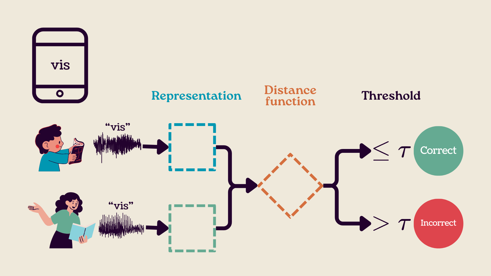

# Child speech benchmark
A benchmark for evaluating speech representation methods on child speech, with a focus on low-resource and few-shot learning scenarios.

[](LICENSE)
[](https://arxiv.org/abs/2507.12217)

## Overview

Imagine a child in a low-resource setting is shown a word on a screen and asked to read it aloud. The audio they produce is recorded and then compared to **adult template recordings** of that same word. By measuring the distance between the child’s recording and the templates, we decide whether the word they said matches the expected one.



This benchmark evaluates how well different **speech representation** and **distance calculation** methods can classify the spoken word as a match or not. The process works as follows:

1. A **binary classifier** makes match/no-match decisions based on the computed distances.

2. A **threshold** is selected to maximize **balanced accuracy** on the development set.

3. This threshold is then applied to classify samples in the test set.

4. The system reports performance using **recall**, **precision**, **F1 score**, **AUC**, **false alarm rate**, **miss rate** and **balanced accuracy** on the test set.

The goal is to find the combination of representation and distance method that gives the best **balanced accuracy**, especially in low-resource speech settings.

## Quick Start
### Programmatic Usage

1. Install the dependencies:

    - Make the setup file executable by running ``chmod +x setup.sh``, then run ``setup.sh``.

    Alternatively, manually install the dependencies:
    - Run ``conda env create -f environment.yml``
    - Run ``cd dtw`` and then ``make`` to compile the cython code for the dynamic time warping module used in the benchmark.


2. Download an applicable few-shot isolated word dataset, like [ISACS](https://reubix29.github.io/isolated-afrikaans-child-speech/), or [use your own](#use-your-own-dataset).

3. In `map.yml`:
    - Add the local path to the chosen dataset.
    - Select a representation method:
        - **mhubert**: a multilingual HuBERT model.
        - **hubert_discrete**: discrete speech codes.
        - **mfccs**: mel-frequency cepstral coefficients.
        - **whisper**: English Whisper transcriptions.
        - or [create your own](#test-a-custom-representation-or-distance-method)
    - Select a distance function:
        - **dtw**: dynamic time warping. This is usually used for continuous representations. 
        - **ned**: normalised edit distance. This is usually used for discrete representations.
        - or [create your own](#test-a-custom-representation-or-distance-method)
    - Select a template ranking method:
        - **avg**: average the distances from the query to the template representations
        - **min**: select the minimum distance of all the templates
        - **barycentre**: Calculate a single representative example of the templates, which results in a single distance value between each query and the barycentre representation.
    - Choose the template speaker you would like to use. In [ISACS](https://reubix29.github.io/isolated-afrikaans-child-speech/), there are four speakers available:
        - **sp_1** : Male 1
        - **sp_2** : Female 1
        - **sp_3** : Male 2
        - **child** : Child templates selected from the *train* set of the babaloon dataset.

5. In your terminal, run `python run_benchmark.py`, which should result in a list of metrics.

### Use your own dataset

If you want to test methods on your own data, the dataset should be structured as follows:

```dataset/
├── query/
│   ├── dev/
│   │   ├── word_1/
│   │   │   ├── pos_sample1.wav
│   │   │   ├── pos_sample2.wav
│   │   │   ├── neg_sample1.wav
│   │   │   └── neg_sample2.wav
│   │   └── word_2/
│   │       ├── ...
│   └── test/
│       ├── word_1/
│       │   ├── pos_sample1.wav
│       │   ├── ...
│       └── word_2/
│           ├── ...
├── templates/
│   ├── speaker_1/
│   │   ├── word_1/
│   │   │   ├── template1.wav
│   │   │   ├── template2.wav
│   │   └── word_2/
│   │       ├── ...
│   ├── speaker_2/
│   │   ├── word_1/
│   │   └── word_2/
│   └── ...
```

> Note:
> - For both the dev and test sets, each word must have an equal number of positive and negative examples. This ensures that evaluation metrics like precision and recall remain fair and balanced.
> - Ensure that speakers in the dev and test sets are unique (i.e., they do not appear in both sets).
> - For each template word, make sure to include the same number of samples. This keeps comparisons across words consistent.

For an example of correct structure, look at the structure of [ISACS](https://reubix29.github.io/isolated-afrikaans-child-speech/).

### Use a custom representation or distance method

A working representation function should take in a `torchaudio` [Tensor](https://docs.pytorch.org/audio/stable/generated/torchaudio.load.html#torchaudio.load) as a parameter, and return a continuous or discrete representation of that audio.

Next, you must add a `@register_rep_fn("rep_fn_alias", "rep_fn_type")` decorator above the custom representation function to register it. `rep_fn_alias` is a shorthand name for the representation function that you can use when selecting it in map.yml. `rep_fn_type` is either `"continuous"` or `"discrete"`. After registering your representation function, you may select it in `map.yml` by setting `representation_function : "rep_fn_alias"`.

Continuous representations can be evaluated with dynamic time warping (`dtw`), and discrete representations can be evaluated with normalised edit distance (`ned`), but you may need to create a custom distance method depending on your representation function.

To register a distance function, similar to the representation functions, you may add a `@register_dist_fn("dist_fn_alias")` above your distance function to register it. Then select it in `map.yml` by setting `distance_function : "dist_fn_alias"`.


## Results on ISACS (sp_1)
| Representation (*ranking*)| Recall | Precision | F1 | ROC AUC | False Alarm Rate | Miss Rate | Balanced Accuracy |
|:---|:---:|:---:|:---:|:---:|:---:|:---:|:---:|
| **MFCCs** (*avg*)| 71.6 | 63.7 | 64.8 | 70.5 | 46.5 | 28.4 | 65.6 |
| **mHuBERT continuous** (*avg*) | 57.3 | 65.2 | 59.5 | 66.0 | 34.4 | 42.7 | 65.3 | 
| **mHuBERT continuous** (*barycentre*) | 61.0 | 62.7 | 60.7 | 65.9 | 39.7 | 39.0 | 65.3 | 
| **Whisper English ASR** (*avg*)| 51.1 | 74.2 | 55.8 | 70.7 | 21.5 | 48.5 | 64.9| 
| **HuBERT discrete** (*min*)| 61.7 | 63.9 | 61.6 | 66.3 | 36.1 | 38.3 | 63.0 | 
| **mHuBERT continuous** (*min*) | 49.7 | 64.0 | 53.7 | 63.8 | 31.6 | 50.3 | 63.0 | 
| **MFCCs** (*min*)| 86.3 | 60.11 | 69.6 | 69.3 | 62.7 | 13.7 | 62.3 | 
| **HuBERT discrete** (*avg*)| 66.3 | 59.9 | 61.3 | 65.3 | 42.3 | 33.7 | 60.6 |
| **HuBERT discrete** (*barycentre*) | 45.3 | 61.6 | 50.0 | 68.2 | 24.5 | 54.7 | 58.8 |
-----


